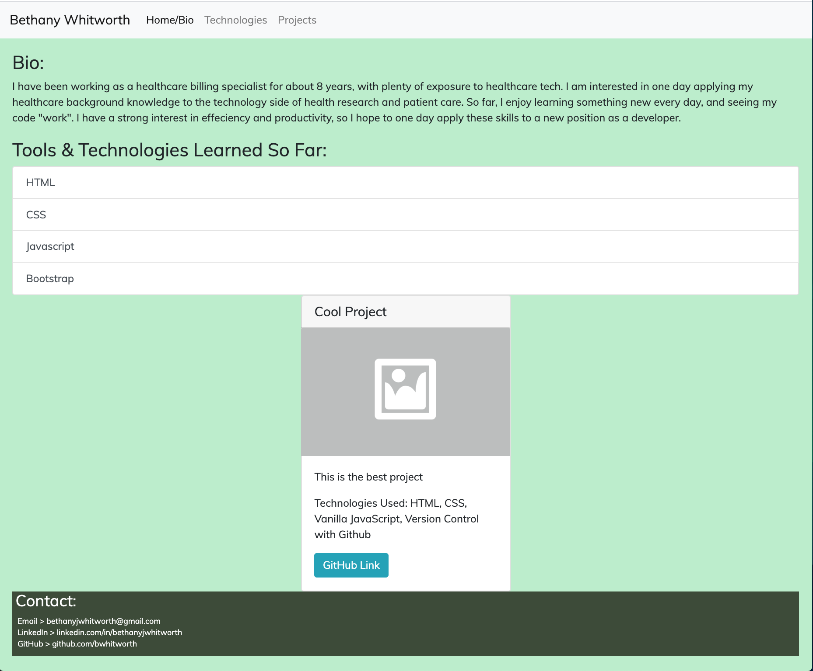

# Personal Bio Site

### Technologies Used:
HTML5, CSS, Vanilla Javascript, Bootstrap

### Description:
NSS project for personal biography site.  Used to display developer skills and projects. 
> _To be updated frequently as NSS course progresses, and upon graduation_

### Screenshot:
#### (work-in-progress)

### Instructions to Run:
1. If you do not have npm http-server installed, follow instuctions [here](https://www.npmjs.com/package/http-server) to install on your device
1. Use GitHub's [Cloning Feature](https://help.github.com/en/github/creating-cloning-and-archiving-repositories/cloning-a-repository) to download a local copy of the files for this project
1. In your command line interface, change directory into the folder that contains your copied files
1. Enter command: `http-server -p 8080` or `hs -p 8080`
1. The project will now render in your browser at url: `http://localhost:8080`
